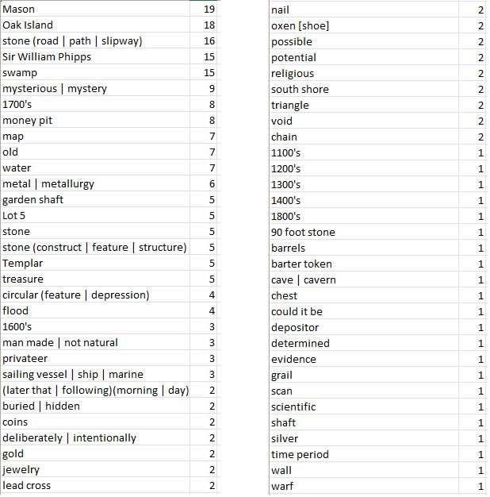

# Acorn Vocab
## A vocabulary template from the Curse of Oak Island tv show. 
The template shows words or phrases of interest heard during the show and a category index which groups words of similar use (place names, artifact types, peoples names). These words and categories may change from episode to episode.  Some of the words were chosen to illuminate the style of speaking about something (the treasure) which may not exist (_mysterious, possible, potential_).
## The Vocab Game
To play the Vocab Game print the template in either catagory order or alphabetic order and, as you listen to the show, count occurences of the key words and phrases.  This will keep you too busy to watch the same repeating animations and the swiveling head shots.  At the end of the show, analyze the word use counts to uncover ways in which the script writers try to hold the viewers attention about a search that is never consumated.  How does the script use appeals to common (or uncommon) conspiracy theories, high tech data analysis, or the allure of ancient treasure to make rusty metal and bits of wood seem exciting?  
